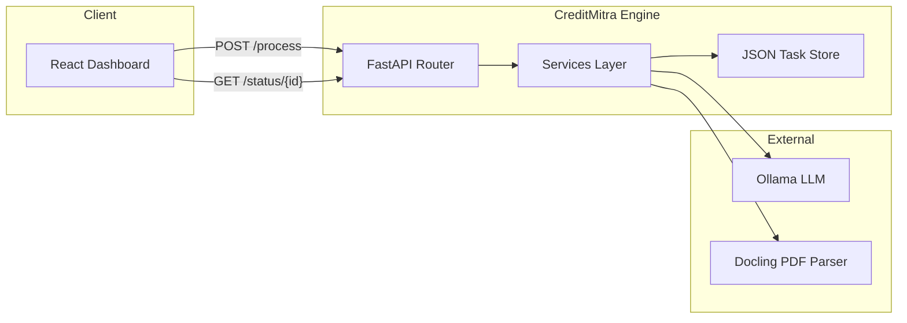

# CreditMitra Engine

[](https://github.com/CreditMitra-TIH-IITB/CreditMitra-engine/actions/workflows/ci.yml)

> Bank-statement analysis pipeline — PDF extraction, transaction enrichment via a locally-hosted Ollama LLM.

---

## Architecture



### Directory Layout

```
├── app/
│   ├── api/v1/            # Route handlers
│   ├── core/              # Settings & config
│   ├── schemas/           # Pydantic models
│   └── services/          # Business logic (extraction, task store)
├── tests/                 # Pytest test suite
├── data/                  # Runtime data (git-ignored)
│   ├── tasks/             # Task JSON files
│   └── uploads/           # Temporary PDF uploads
├── pyproject.toml         # Project metadata, deps, tool config
├── Dockerfile             # Multi-stage production build
└── .github/workflows/     # CI pipeline
```

---

## Prerequisites

| Dependency | Version | Purpose |
|------------|---------|---------|
| Python     | ≥ 3.10  | Runtime |
| Ollama     | Latest  | Local LLM for payee prediction |

---

## Quick Start

```bash
# Clone & enter
git clone https://github.com/CreditMitra-TIH-IITB/CreditMitra-engine.git
cd CreditMitra-engine

# Create virtual environment
python -m venv venv

# Activate (PowerShell)
.\venv\Scripts\Activate.ps1
# Activate (macOS/Linux)
# source venv/bin/activate

# Install with dev dependencies
pip install -e ".[dev]"

# Run the server
uvicorn app.main:app --reload
```

The API is now available at **http://127.0.0.1:8000** with docs at [`/docs`](http://127.0.0.1:8000/docs).

---

## Docker

```bash
docker build -t creditmitra-engine .
docker run -p 8000:8000 creditmitra-engine
```

> **Note:** Ollama must be reachable from inside the container. Use `--network host` or set `OLLAMA_HOST` to the host machine's IP.

---

## API Reference

All routes are prefixed with `/api/v1`.

| Method | Path | Description |
|--------|------|-------------|
| `POST` | `/api/v1/statements/process` | Upload a PDF, returns `{ task_id, status }` |
| `GET`  | `/api/v1/statements/status/{id}` | Poll task status and retrieve results |
| `GET`  | `/health` | Health check (no prefix) |

### Task Lifecycle

```
pending → processing → completed │ failed
```

---

## Configuration

Set via environment variables or a `.env` file in the project root.

| Variable | Default | Description |
|----------|---------|-------------|
| `OLLAMA_HOST` | `http://127.0.0.1:11434` | Ollama server URL |
| `OLLAMA_MODEL` | `payee-lora:latest` | Model for payee prediction |
| `DATA_DIR` | `./data` | Root for tasks/ and uploads/ |

---

## Development

### Setup Pre-commit Hooks

```bash
pre-commit install
```

### Linting & Formatting

```bash
ruff check .            # Lint
ruff format .           # Format
ruff format --check .   # Check formatting (CI mode)
```

### Type Checking

```bash
mypy app/
```

### Testing

```bash
pytest --tb=short -q
```

---

## License

MIT
