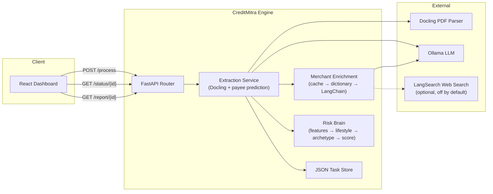

# CreditMitra Engine

[](https://github.com/CreditMitra-TIH-IITB/CreditMitra-engine/actions/workflows/ci.yml)

> Bank-statement analysis pipeline — PDF extraction, payee prediction, merchant
> enrichment, and an alternative-data lifestyle credit score, all from a
> locally-hosted LLM plus an optional web-search fallback.

---

## Architecture



### Pipeline stages (`process_pdf_task`)

1. **Extract** — Docling pulls transaction tables out of the PDF; junk rows
   (orphan `Chq:` refs, Opening/Closing Balance rows) are filtered and
   amounts/dates/direction are parsed.
2. **Predict payee** — a locally-hosted Ollama model (`payee-lora`) extracts
   the payee from each narration.
3. **Classify** — an ONNX model labels each payee `person` or `merchant`.
4. **Enrich** — merchant-classified payees are resolved to a category,
   lifestyle dimension, and risk flag via cache → static dictionary → a
   web-search-grounded LangChain fallback (see [Merchant Enrichment](#merchant-enrichment) below).
5. **Score** — the risk brain turns enriched transactions into a 300–900
   lifestyle credit score (see [Risk Scoring](#risk-scoring-track-b) below).

### Directory Layout

```
├── app/
│   ├── api/v1/                    # Route handlers
│   │   └── statements.py          # /process, /status/{id}, /report/{id}
│   ├── core/
│   │   ├── config.py               # Settings & env vars
│   │   └── scoring_config.py       # Score weights, bands, cash-flow constants
│   ├── schemas/
│   │   └── statements.py           # Pydantic contracts (frozen — Issue #1)
│   └── services/
│       ├── extraction.py           # Docling + payee prediction, orchestrates the pipeline
│       ├── parsing.py              # Amount/date/direction parsing, row filtering
│       ├── merchant_classifier.py  # ONNX person/merchant classifier
│       ├── merchant_enrichment.py  # Cache → dictionary → LangChain fallback
│       ├── feature_engineering.py  # Transactions -> FeatureVector
│       ├── lifestyle_profile.py    # Transactions + features -> the 6 L-indices
│       ├── archetype.py            # Rule-based spending-archetype classifier
│       ├── credit_scorer.py        # Features + lifestyle -> final CreditRiskReport
│       └── task_store.py           # JSON file-based task persistence
├── data/
│   ├── india_merchants.json        # Merchant dictionary (tracked — Issue #6)
│   ├── models/                     # ONNX classifier models (git-ignored, ~2.3GB)
│   ├── tasks/                      # Task JSON files (git-ignored)
│   └── uploads/                    # Temporary PDF uploads (git-ignored)
├── docs/
│   ├── taxonomy.md                 # Merchant category taxonomy & scoring weights (frozen — Issue #4)
│   └── enrichment_api.md           # Merchant-server HTTP contract
├── tests/
│   ├── fixtures/
│   │   ├── personas/               # 6 synthetic transaction histories (acceptance test data)
│   │   ├── sample_transactions_raw.json
│   │   ├── sample_transactions_enriched.json
│   │   └── sample_report.json
│   └── *.py                        # Pytest suite
├── pyproject.toml                  # Project metadata, deps, tool config
├── Dockerfile                      # Multi-stage production build
└── .github/workflows/               # CI pipeline
```

---

## Prerequisites

| Dependency | Version | Purpose |
|------------|---------|---------|
| Python     | ≥ 3.10  | Runtime |
| Ollama     | Latest  | Local LLM for payee prediction + merchant enrichment |
| LangSearch API key | optional | Web-search grounding for merchants the local model doesn't recognize (off by default) |

---

## Quick Start

```bash
# Clone & enter
git clone https://github.com/CreditMitra-TIH-IITB/CreditMitra-engine.git
cd CreditMitra-engine

# Create virtual environment
python -m venv venv

# Activate (PowerShell)
.\venv\Scripts\Activate.ps1
# Activate (macOS/Linux)
# source venv/bin/activate

# Install with dev dependencies
pip install -e ".[dev]"

# Pull the Ollama models this pipeline uses
ollama pull payee-lora:latest          # payee span extraction
ollama pull qwen2.5:1.5b-instruct      # merchant enrichment (NOT payee-lora — see docs/taxonomy.md)

# Run the server
uvicorn app.main:app --reload
```

The API is now available at **http://127.0.0.1:8000** with interactive docs
(Swagger UI) at [`/docs`](http://127.0.0.1:8000/docs) and ReDoc at `/redoc`.

---

## Docker

```bash
docker build -t creditmitra-engine .
docker run -p 8000:8000 creditmitra-engine
```

> **Note:** Ollama must be reachable from inside the container. Use `--network host` or set `OLLAMA_HOST` to the host machine's IP.

---

## API Reference

All routes are prefixed with `/api/v1`.

| Method | Path | Description |
|--------|------|-------------|
| `POST` | `/api/v1/statements/process` | Upload a PDF, returns `{ task_id, status }` |
| `GET`  | `/api/v1/statements/status/{id}` | Task status + transactions (payee/merchant classification) |
| `GET`  | `/api/v1/statements/report/{id}` | Task status + the lifestyle credit report (score/archetype/factors) |
| `GET`  | `/health` | Health check (no prefix) |

`/status` and `/report` are deliberately separate: the extraction page only
needs transactions, the report page only needs the score — neither waits on
data it doesn't render. Both read from the same underlying task record, so
there's no extra processing cost to calling both.

### Task Lifecycle

```
pending → processing → completed │ failed
```

`report` on `/report/{id}` can be `null` even when `status` is `completed` —
scoring is a best-effort addition on top of a successful extraction, never a
requirement for it (a statement with too little parsed data just gets no
report, not a failed task).

---

## Merchant Enrichment

Resolves a merchant name (e.g. `"SWIGGY LI"`, truncated from a UPI narration)
to a category, lifestyle dimension, and risk flag, in three tiers of
increasing cost:

1. **SQLite cache** — every merchant is resolved at most once, ever.
2. **Static dictionary** (`data/india_merchants.json`) — ~85 known Indian
   merchants with alias/truncation matching.
3. **LangChain fallback** — for dictionary misses, grounds classification in
   real web-search content (LangSearch) rather than letting a small local
   model guess from the name alone; if web search is off or finds nothing,
   the merchant resolves to `unknown()` rather than a fabricated category.

The **only** thing that ever leaves the process during enrichment is a
merchant name string (plus a fixed disambiguation suffix for the web-search
query) — never transaction narrations, amounts, dates, balances, or
person-classified payees. See [`docs/enrichment_api.md`](docs/enrichment_api.md)
for the full contract and [`docs/taxonomy.md`](docs/taxonomy.md) for the
category list.

---

## Risk Scoring (Track B)

Turns a statement's enriched transactions into a 300–900 lifestyle credit
score:

- **`feature_engineering.py`** — cash-flow features: salary/gig-income
  detection, FOIR, balance buffer, essential/discretionary spend ratios,
  cash-withdrawal and bounced-payment detection.
- **`lifestyle_profile.py`** — six 0–100 lifestyle indices (essential
  stability, aspirational spend, digital maturity, commitment, leverage,
  risk appetite) plus behavioural texture (category diversity, merchant
  loyalty, spending burstiness).
- **`archetype.py`** — classifies the profile into one of: Salaried Saver,
  Gig Hustler, BNPL-Heavy Spender, Gambler, Aspirational Overspender,
  Cash-Reliant Informal, or Balanced.
- **`credit_scorer.py`** — combines the lifestyle indices and cash-flow
  features into a final score, band, and human-readable factors.

Weights are expert-set (`app/core/scoring_config.py`), not fitted to
labelled data — validated instead by a persona-ranking acceptance test
(`tests/test_persona_ranking.py`) against six synthetic transaction
histories in `tests/fixtures/personas/`, each built to stress one axis of
the model. **Healthcare spend is fully excluded from every ratio and index**
(fair lending) — never just zero-weighted.

Full weighting table, category taxonomy, and scoring rationale live in
[`docs/taxonomy.md`](docs/taxonomy.md).

---

## Configuration

Set via environment variables or a `.env` file in the project root.

| Variable | Default | Description |
|----------|---------|-------------|
| `OLLAMA_HOST` | `http://127.0.0.1:11434` | Ollama server URL |
| `OLLAMA_MODEL` | `payee-lora:latest` | Model for payee prediction |
| `ENRICHMENT_LLM_ENABLED` | `true` | Master switch for the merchant enrichment fallback |
| `ENRICHMENT_LLM_MODEL` | `qwen2.5:1.5b-instruct` | Model for enrichment classification — **not** `payee-lora` (that's fine-tuned for span extraction, not classification) |
| `ENRICHMENT_WEBSEARCH_ENABLED` | `false` | Enable LangSearch grounding for merchants the local model doesn't recognize |
| `LANGSEARCH_API_KEY` | `""` | Required when web search is enabled |
| `ENRICHMENT_WEBSEARCH_TIMEOUT` | `8.0` | Seconds before a web-search call gives up |
| `DATA_DIR` | `./data` | Root for tasks/uploads/models/cache |

---

## Development

### Setup Pre-commit Hooks

```bash
pre-commit install
```

### Linting & Formatting

```bash
ruff check .            # Lint
ruff format .           # Format
ruff format --check .   # Check formatting (CI mode)
```

### Type Checking

```bash
mypy app/
```

### Testing

```bash
pytest --tb=short -q
```

The test suite includes privacy-payload tests (asserting enrichment never
leaks narration/amount/date data — Issue #9), web-search-grounding
regression tests, and the persona-ranking acceptance suite for the risk
scorer. All use fixtures/mocks — no live Ollama or LangSearch calls are
required to run the suite.

---

## License

MIT
